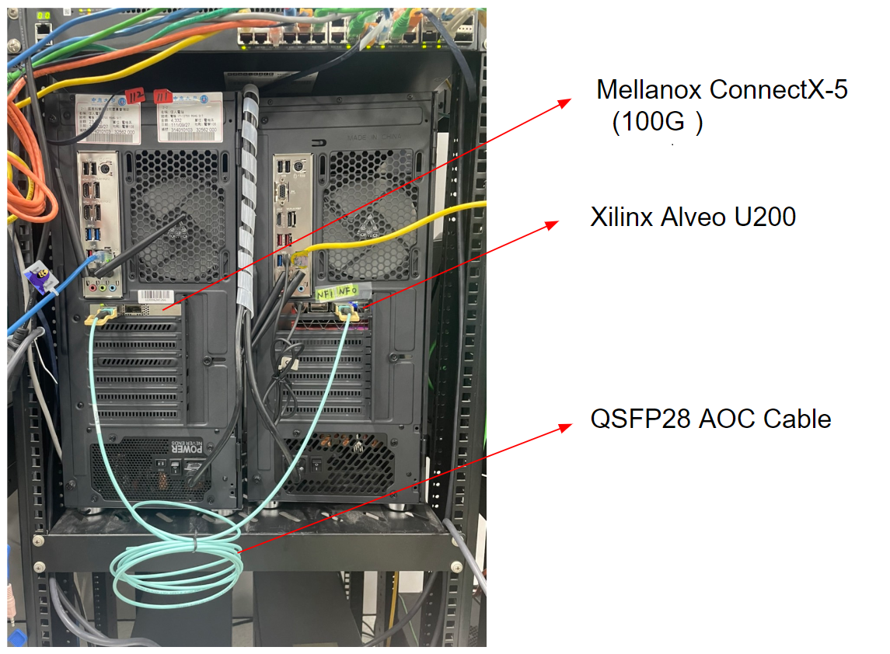
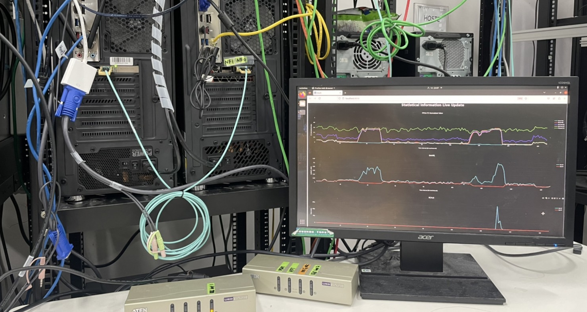

This paper presents an implementation of the Frequency Moment estimation utilizing the 100Gbps Xilinx Alveo U200 acceleration card of the NetFPGA-PLUS platform. We further showcase its applications in scan anomaly detection and parameter estimation for the Weibull model of flow length distribution.

The frequency moment estimator is realized by Verilog HDL in the data plane of the NetFPGA-Plus framework in an UltraScale+ XCU200 FPGA.

## Testbed Setup

The trace can be re-played by using TCPReplay via Mellanox ConnectX-5 100G NIC to the Xilinx Alveo U200 FPGA card through a QSFP28 AOC Cable.

{width=50%}

### Program the FPGA with the bit file

~~~
$make bit
~~~

(then, restarts the system while still powered up (warm reboot) )

### Update tables and parameters

~~~
$make update
~~~

### Start the Dash Board

~~~
$make read
~~~

### Replay the traffic trace

